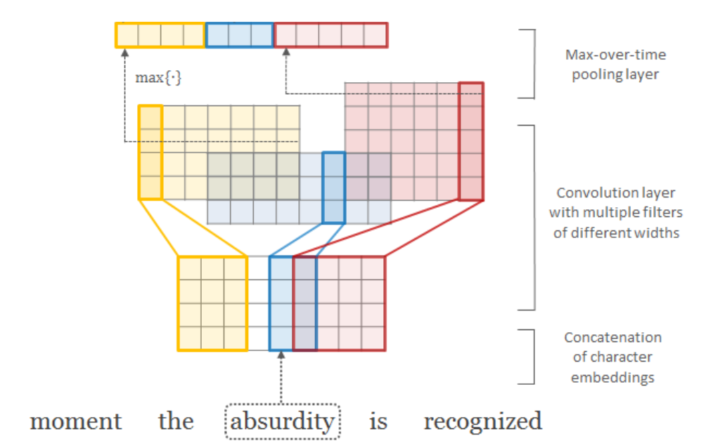

# Pytorch Time Delayed NN
Time Delayed NN implemented in [PyTorch](http://www.pytorch.org).


## Usage

```python
kernels = [(1, 25), (2, 50), (3, 75), (4, 100), (5, 125), (6, 150)]

tdnn = TDNN(kernels, input_embedding_size)

# in is tensor with shape [batch_size, max_seq_len, max_word_len, char_embed_size]
out = tdnn(in)
```


